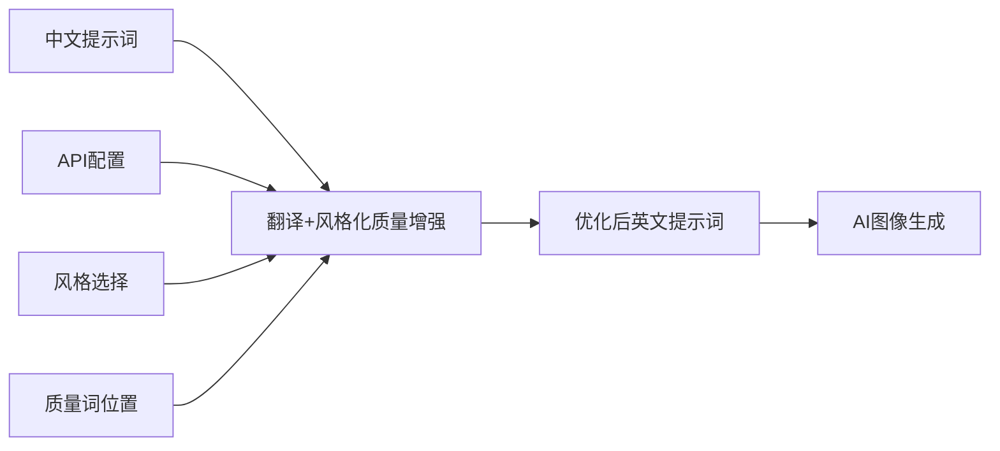
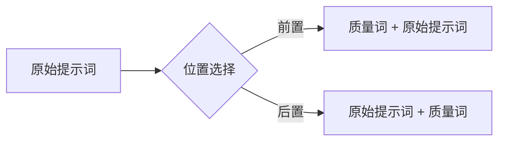
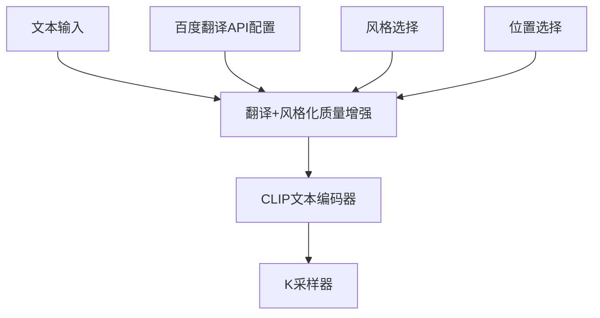
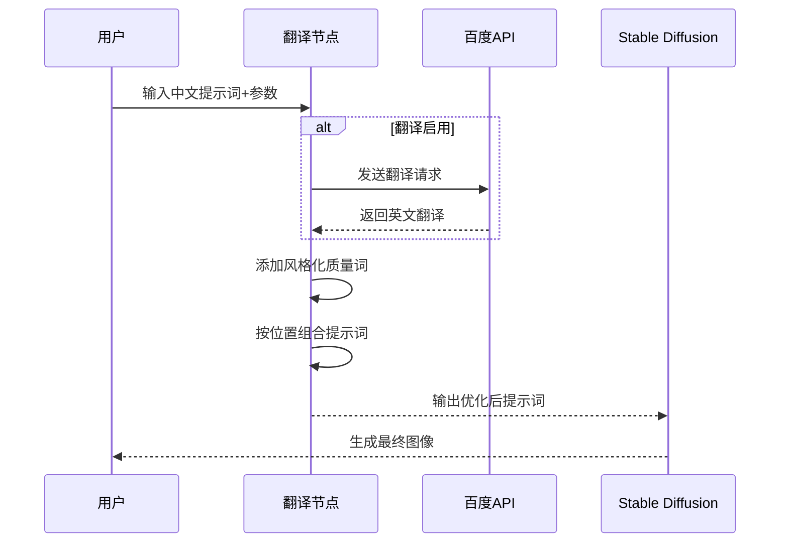

# 🚀 百度翻译+风格化质量增强节点

专为ComfyUI设计的智能提示词处理节点，提供中文到英文的翻译功能，并根据选择的风格和位置添加专业质量词，优化AI生成效果。



## ✨ 核心功能
- **智能翻译**：百度翻译API中文→英文转换
- **风格化增强**：5种预设风格（卡通/赛博朋克/写实等）
- **位置控制**：质量词前置或后置（推荐后置）
- **强度调节**：0.0-2.0可调质量词数量
- **实时监控**：详细日志显示处理过程

## 📥 安装指南

### 1. 下载节点
将整个 `TranslateQualityNode` 文件夹放入ComfyUI的 `custom_nodes` 目录：
```
ComfyUI/custom_nodes/TranslateQualityNode
```

### 2. 安装依赖
```bash
# 使用ComfyUI自带的Python环境
python -m pip install requests
```

### 3. 配置百度API密钥
创建配置文件 `config.json`：
```json
{
    "baidu_appid": "填入ID",
    "baidu_key": "填入密钥"
}
```

### 4. 重启ComfyUI

## 🎮 节点使用指南

### 1. 翻译+风格化质量增强器
**功能**：翻译中文提示词并添加风格化质量词

**输入参数**：
| 参数名 | 类型 | 默认值 | 说明 |
|--------|------|--------|------|
| **text** | 字符串 | "" | 中文提示词 |
| **enable_translation** | 布尔 | True | 启用/禁用翻译 |
| **quality_strength** | 滑块 | 1.0 | 质量词强度 (0.0-2.0) |
| **style** | 选项 | "真人写实" | 风格选择 |
| **custom_quality** | 多行文本 | "masterpiece..." | 自定义质量词 |
| **position** | 选项 | "后置" | 质量词位置（前置/后置） |
| **api_config** | 配置 | 可选 | API配置节点连接 |

**输出**：
- **enhanced_text**：优化后的英文提示词

### 2. 百度翻译API配置节点
**功能**：管理API密钥

**输入参数**：
| 参数名 | 类型 | 默认值 | 说明 |
|--------|------|--------|------|
| **baidu_appid** | 字符串 | "" | 百度APPID |
| **baidu_key** | 字符串 | "" | 百度密钥 |

## 🧩 核心功能详解

### 质量词位置控制


**后置优势**：
1. 主体内容优先，AI更关注核心描述
2. 避免质量词干扰图像主体
3. 符合自然语言描述习惯
4. 与Stable Diffusion权重机制更契合

**使用建议**：
- 人物/场景描述：后置（推荐）
- 抽象/艺术创作：前置
- 质量强化：前置+后置组合

### 风格化质量词预览

| 风格 | 关键提示词 |
|------|------------|
| **卡通动漫** | `anime style, cartoon, vibrant colors, cute, detailed line art` |
| **赛博朋克** | `cyberpunk, neon lights, futuristic, sci-fi, rainy cityscape` |
| **真人写实** | `photorealistic, realistic skin texture, detailed eyes, cinematic lighting` |
| **风景油画** | `oil painting, landscape, brush strokes, golden hour lighting` |

### 强度参数解析
| 强度值 | 添加词数 | 适用场景 | 示例效果 |
|--------|----------|----------|----------|
| 0.0 | 0 | 仅翻译 |  |
| 0.5 | 5-7 | 简洁风格 |  |
| 1.0 | 10-12 | 通用场景 |  |
| 1.5 | 15-18 | 高质量要求 |  |
| 2.0 | 20+ | 极致细节 |  |

## 🚦 最佳实践工作流

### 基础工作流


### 参数配置示例
```yaml
# 人物肖像（推荐后置）
text: "一位亚洲女性，黑色长发，在樱花树下"
style: "真人写实"
position: "后置"
quality_strength: 1.2
custom_quality: "detailed eyes, soft lighting"

# 赛博朋克场景（推荐前置）
text: "未来城市夜景，霓虹灯光"
style: "赛博朋克"
position: "前置"
quality_strength: 1.5
custom_quality: "neon glow, rain effects"

# 风景油画（后置）
text: "秋天的山丘，金色树叶"
style: "风景油画"
position: "后置"
quality_strength: 0.8
```

## ⚙️ 技术细节

### 处理流程


### 配置优先级
1. **节点输入**：工作流中直接配置
2. **配置文件**：`custom_nodes/TranslateQualityNode/config.json`
3. **环境变量**：`BAIDU_TRANSLATE_APPID`, `BAIDU_TRANSLATE_KEY`


## 📚 资源与支持

### 获取百度API密钥
1. 访问[百度翻译开放平台](https://api.fanyi.baidu.com/)
2. 注册账号 → 创建"通用翻译"服务
3. 获取APP ID和密钥（免费5万字符/月）

### 示例工作流
[下载示例工作流文件](workflows/example_workflow.json) - 导入ComfyUI快速使用

> **专业提示**：质量词后置通常能获得更自然的结果，特别是描述人物或具体场景时。前置适合强调整体画面质量。

## 🚀 高级技巧
1. **组合使用**：前置基础质量词 + 后置风格词
2. **渐进增强**：从强度0.8开始，逐步增加
3. **自定义词库**：建立个人常用词库文件
4. **批量处理**：配合脚本一次性处理多提示词

**版本更新**：v1.0.0新增位置控制功能，优化提示词结构，提升生成效果！